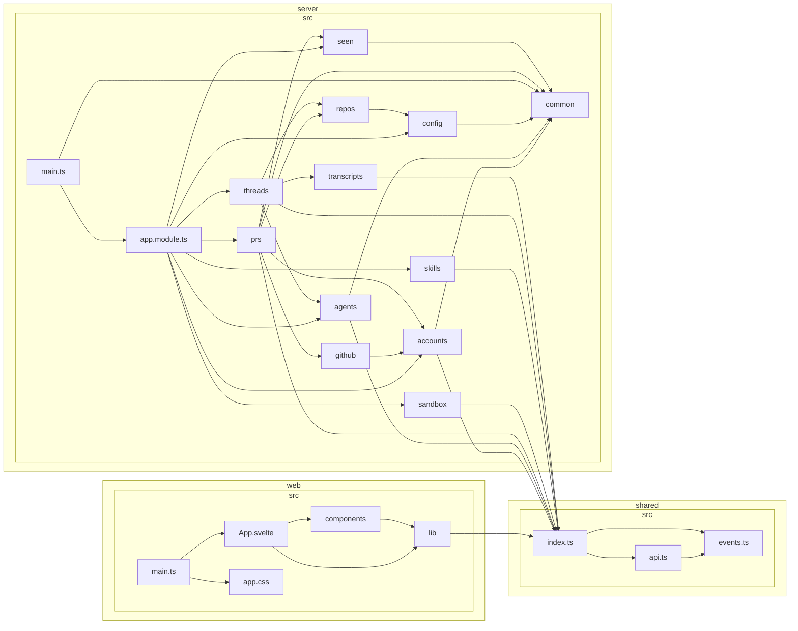

# Dependency graph

Generated by `pnpm graph` — do not edit by hand.

Folder-level view of how the three workspaces depend on each other. The rules that
keep this shape honest live in `.dependency-cruiser.cjs` and are enforced by
`pnpm graph:check`: no cycles, `web` and `server` never import each other, and
`shared` stays a leaf so it can be the contract both sides import.

93 modules, 215 dependencies, 0 rule violations.
